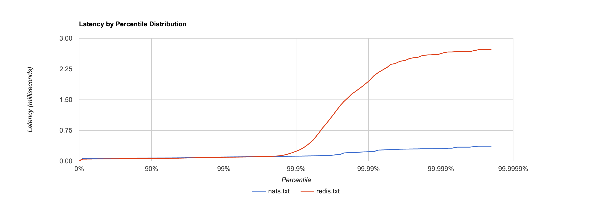

# bench [](https://godoc.org/github.com/tylertreat/bench)

Bench is a generic latency benchmarking library. It's generic in the sense that it exposes a simple interface (`Requester`) which can be implemented for various systems under test. Several [example Requesters](https://github.com/tylertreat/bench/tree/master/requester) are provided out of the box.

Bench works by attempting to issue a fixed rate of requests per second and measuring the latency of each request issued synchronously. Latencies are captured using [HDR Histogram](https://github.com/codahale/hdrhistogram), which observes the complete latency distribution and attempts to correct for [Coordinated Omission](https://groups.google.com/forum/#!msg/mechanical-sympathy/icNZJejUHfE/BfDekfBEs_sJ). It provides facilities to generate output which can be [plotted](http://hdrhistogram.github.io/HdrHistogram/plotFiles.html) to produce graphs like the following:



## Example Benchmark

```go
package main

import (
	"fmt"
	"time"

	"github.com/tylertreat/bench"
	"github.com/tylertreat/bench/requester"
)

func main() {
	r := &requester.RedisPubSubRequesterFactory{
		URL:         ":6379",
		PayloadSize: 500,
		Channel:     "benchmark",
	}

	benchmark := bench.NewBenchmark(r, 10000, 1, 30*time.Second, 0)
	summary, err := benchmark.Run()
	if err != nil {
		panic(err)
	}

	fmt.Println(summary)
	summary.GenerateLatencyDistribution(bench.Logarithmic, "redis.txt")
}
```
